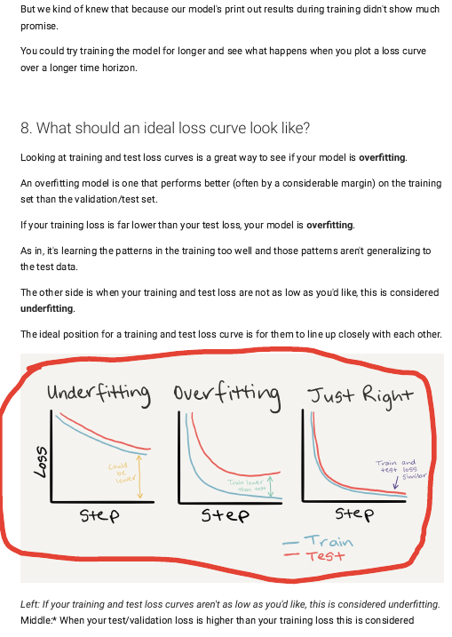
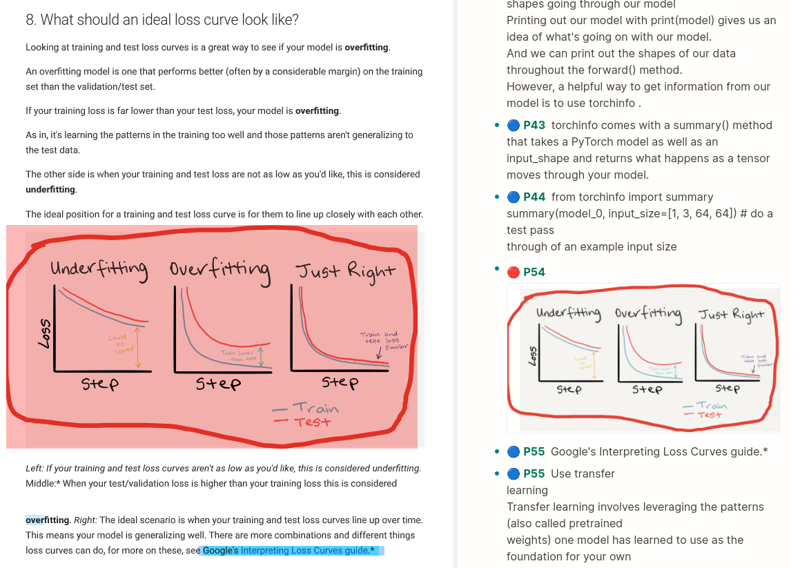

# pdfannotations_to_logseq
Import pdf into logseq but also import annotations made from other softwares

## Status
* *work in progress*
* The text highlights are correctly parsed.
* Other type of annotation (lines, shapes, rectangles, etc) are parsed as "area highlight" (open an issue if something goes wrong)
* Colors are correctly matched to logseq's available colors.

## Usage
* `python -m pip install -r requirements.txt`
* `python __init__.py path_to_pdf --md_path path_to_md --edn_path path_to_edn`

## Example
### PDF

### Logseq Output

## TODO
* make the annotation using rectangles instead of one large overlapping area

## credits
* [user e-zz who was indispensable in getting the annotation locations right](https://github.com/e-zz/logseq-pdf-extract/discussions/3#discussioncomment-7902471)
* [pdfannots](https://github.com/0xabu/pdfannots/)
